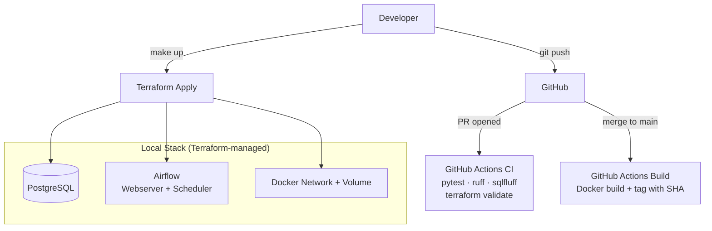

# CI/CD and Infrastructure-as-Code for Data Pipelines

The batch ELT pipeline from project 1, wrapped in a production-grade development workflow: Terraform manages the infrastructure, GitHub Actions runs CI on every PR, and anyone can clone the repo and have the full stack running with a single command.

**Stack:** Terraform (Docker provider), GitHub Actions, Docker, Make, Python, dbt



## How it works

Instead of defining infrastructure in a Docker Compose file, everything is declared in Terraform using the Docker provider: containers, networks, and volumes. This means I get the full Terraform workflow. `terraform plan` to see what will change, `terraform apply` to bring it up, `terraform destroy` to tear it down. Variables and `.tfvars` files handle configuration, so switching between environments is just a different variable file.

I know in production you'd point Terraform at AWS or GCP, not at local Docker containers. The point here is demonstrating the workflow (plan/apply/destroy, state management, variables, outputs) against infrastructure you can actually see and interact with.

Terraform manages eight resources in total: a Docker network, a named volume for Postgres data, the Postgres and Airflow images (Airflow gets built from a local Dockerfile), and four containers. The init container is the interesting one. It uses `must_run = false` and `attach = true`, which tells Terraform to start it, wait for it to finish migrations and create the admin user, then move on. This is the Terraform equivalent of Docker Compose's `service_completed_successfully` condition. The webserver and scheduler depend on the init container, so they only start once the database is ready.

On the CI side, every pull request triggers a GitHub Actions pipeline that lints the Python with ruff, lints the SQL with sqlfluff, runs pytest against the extraction logic, and validates the Terraform configuration. On merge to main, a separate workflow builds the Docker image and tags it with the git SHA.

The repo also has pre-commit hooks for ruff, sqlfluff, and terraform fmt. Between the hooks and the CI, it's hard to land bad code.

## Design decisions

**Terraform over Docker Compose.** Docker Compose works fine for local development, and project 1 uses it. But Compose is a standalone tool with its own file format. It doesn't connect to anything else. Terraform brings state management, a plan/apply workflow, and the same language you'd use for cloud infrastructure. The muscle memory of writing `terraform plan` before `terraform apply` carries over to real AWS/GCP work.

**Docker provider over a cloud provider.** I wanted this to be runnable on any machine with Docker installed, no cloud accounts or credentials required. The Docker provider gives you real Terraform resources (you can see them in `terraform state list`, reference their attributes, and wire dependencies between them) but everything is local. Swap the provider and tweak the resource types and this could deploy to ECS or Cloud Run.

**Make over shell scripts.** A Makefile gives you discoverability (`make <tab>` shows every available command) and it's already on every developer's machine. The targets are thin wrappers around Terraform commands, so there's no magic. If you don't want to use Make, you can always run the Terraform commands directly.

**Separate CI and build workflows.** The CI workflow runs on pull requests and is fast: linting, tests, config validation. No Docker builds, no deploys. The build workflow runs on merge to main and produces a tagged image. This separation means PRs get feedback in seconds rather than waiting for a full image build.

**Pre-commit hooks.** Ruff, sqlfluff, and terraform fmt all run before each commit. This catches most issues locally, so CI failures are rare. The hooks match exactly what CI runs (same tools, same config) so there are no surprises.

**Unit tests for extraction only.** The extraction script is the only piece of custom logic that runs outside the database. dbt models are tested by dbt, Terraform config is tested by `terraform validate`, and linting catches style issues. The pytest suite focuses on the extraction function: does it parse the API response correctly, does it handle missing data, does it pass the right parameters. No point in testing what the frameworks already test.

## Project layout

```
├── Makefile                          # make up / down / test / lint
├── Dockerfile                        # custom Airflow image with dbt
├── terraform/
│   ├── main.tf                       # Docker provider, all resources
│   ├── variables.tf                  # configurable inputs
│   ├── outputs.tf                    # Airflow URL, psql command
│   └── terraform.tfvars              # default values
├── .github/workflows/
│   ├── ci.yml                        # PR checks: lint + test + validate
│   └── build.yml                     # merge: Docker build + tag
├── dags/
│   └── weather_pipeline.py           # Airflow DAG
├── extract/
│   └── open_meteo.py                 # API extraction script
├── dbt_project/
│   ├── models/staging/               # deduplication, type casting
│   ├── models/marts/                 # fact table with city dimensions
│   └── seeds/dim_cities.csv          # 10 UK cities
├── scripts/
│   ├── init-db.sh                    # PostgreSQL schema setup
│   └── init-airflow.sh               # migrations + admin user
├── tests/
│   └── test_open_meteo.py            # 7 unit tests, mocked API
├── .pre-commit-config.yaml           # ruff, sqlfluff, terraform fmt
├── .sqlfluff                         # SQL linting rules
└── pyproject.toml                    # ruff + pytest config
```

## Running it

### Prerequisites

Docker, Terraform (>= 1.5), and Make. For local linting and tests: `pip install -r requirements-dev.txt`.

If you're using Docker Desktop on Linux, the socket path differs from the default. Add this to `terraform.tfvars`:

```hcl
docker_host = "unix:///home/<user>/.docker/desktop/docker.sock"
```

### Start the stack

```bash
make up
```

That's it. Under the hood it runs `terraform init` and `terraform apply`, which builds the custom Airflow image, creates the PostgreSQL container, runs database migrations, creates the admin user, then brings up the webserver and scheduler. The Airflow UI is available at `localhost:8080` once the scheduler picks up the DAG (usually within 30 seconds).

```bash
make plan   # terraform plan, preview what will change
make test   # pytest + dbt test
make lint   # ruff + sqlfluff + terraform fmt check
make down   # terraform destroy, clean teardown
```

### Trigger the pipeline

Open [localhost:8080](http://localhost:8080) and log in with **admin / admin**. Unpause the `weather_pipeline` DAG and trigger it. Three tasks run in sequence:

1. **extract_weather** pulls today's weather data from Open-Meteo for 10 UK cities
2. **dbt_run** seeds the `dim_cities` table and builds the staging + mart models
3. **dbt_test** runs `not_null` checks across key columns

### Query the data

```bash
docker exec -it weather-postgres psql -U airflow -d warehouse
```

```sql
-- Raw data as extracted from the API
SELECT * FROM raw.weather_daily ORDER BY city;

-- Deduplicated staging layer
SELECT * FROM public.stg_weather_daily ORDER BY city;

-- Final mart with region and extreme weather flag
SELECT * FROM public.fct_daily_weather ORDER BY city;
```

### Tear it down

```bash
make down
```

This runs `terraform destroy`, which removes every container, network, and volume. Nothing is left behind.

## Why bother with IaC for a local project

Most data engineers can write a pipeline. Fewer can package it so that someone else can clone the repo and have it running in under a minute, with linting, tests, and infrastructure that cleans up after itself. This project is about that gap: the Terraform, the CI, the Makefile, the pre-commit hooks. The stuff that separates a script that works on your machine from a project someone else can actually use.
